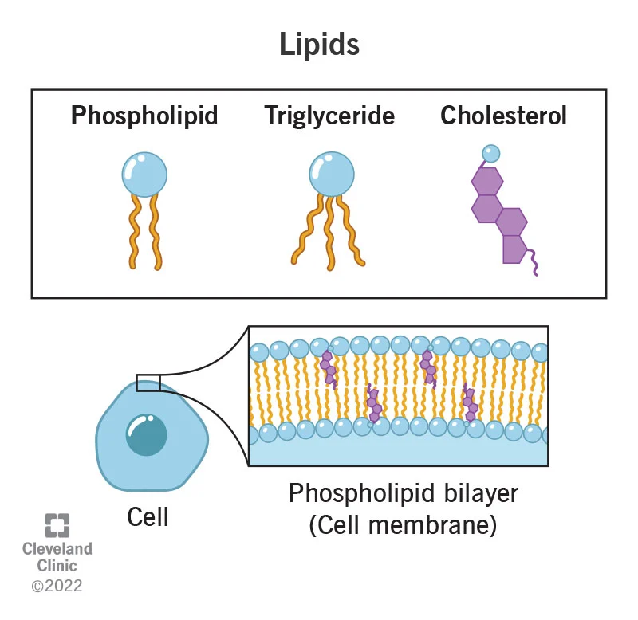
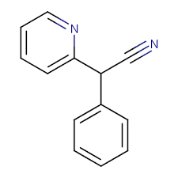
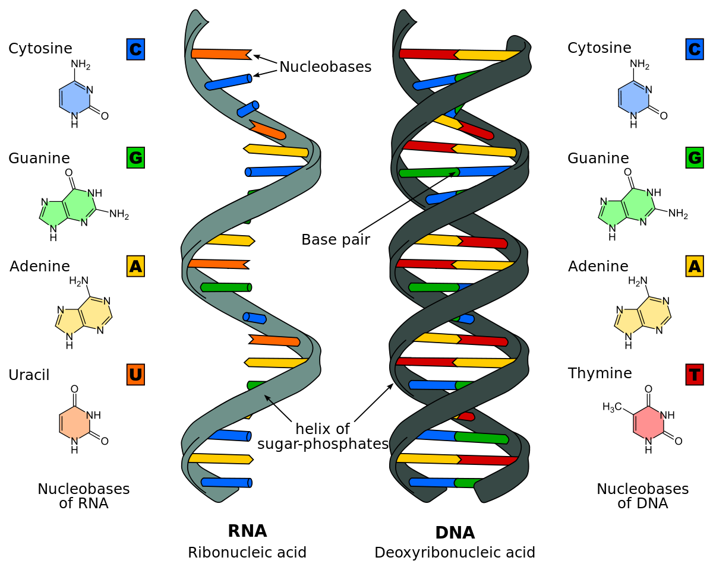

# Biomolecules
## Carbohydrates 

* Short term energy
* Importent source of energy
* Monomers for carbs are monosaccrides
* Contains CH2OH in structure formula
##  Lipids 

* Lipids are better known as fats
* Fat is a source of long term
## Protein 

* Monomer of protein are amnio acids
* Protein helps gain muslce, improve, immune system, and acing as enzymes
* DNA codes for protein are very
important for structure, and function in the body
## Nucleic Acids

* Nucelic Acids include DNA and RNA
* Monomer of Nucleic Acids are nucleotides