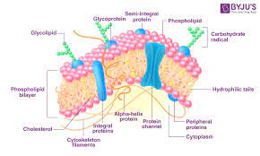

## Plasma Membrane

* Phospholipid: A lipid containing a phosphate group in its molecule
* Integral Protein: Movement of molecules across them and transaction of energy and signals
* Peripherall protein: Intereact with the surface of lipid bilayer of cell membranes
* Cholestrol maintains the structural intergral and regualting the fluidity
* Glycolipid maintains the cell's membrane. It also helps cell to cell communication
* Glycoprotein helps cells signal, and cell to cell rcognition,and cell adhesion