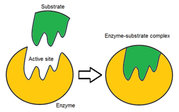

## Enzyme Notes
* Enzyme are chemicals that aren't consumed in a reaction but can speed up a reaction
* Catalase that's found in almost any living cells
* Catalase breaks down hydrogen peroxide 
* Enzymess tug on the subsrate and break it down
* Every step of photosynthesis we need enzymes 

[Enzyme Video](https://www.youtube.com/watch?v=ok9esggzN18&ab_channel=BozemanScience)