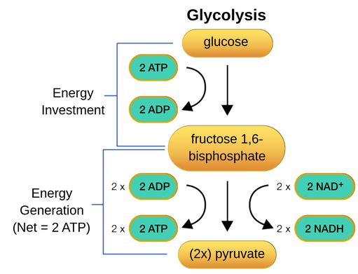

## Biology Notes
# Glycolsis 
* converts glucose to pyruvate
* oxidation of glucose to generate ATP
* occurs in the cytoplasm
* NAD+ takes elevtrons and turns it into NADH
* pyruvate is made and ATP is produced

## Link Reaction
* stage in cellular respiration that lines two other sides
* converts products from glycolysis into reactions for kerbs cycle

